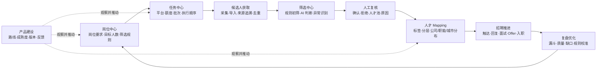

# 产品建设页面与完整产品方案

## 1. 目标与定位

BOSS Local Capture 的目标不是堆叠采集、筛选、导出按钮，而是逐步形成一套面向 HR 招聘、筛选和人才 Mapping 的本地工作台。

当前阶段的优先级是把已有能力变得可理解、可验证、可持续完善：先跑稳“岗位 → 采集 → 初筛 → 复核 → 入库 → 状态更新 → 导出”的基础闭环，再扩展多岗位、多平台、资源额度、自动触达、团队权限和经营分析。

“产品建设”页面是产品的开发地图，不是第二套复杂的项目管理工具。它必须同时回答五个问题：

1. 当前版本到底已经能做什么？
2. 哪些只是可试用，哪些仍停留在方案阶段？
3. 每个模块理想状态是什么？
4. 下一步开发和验收依据是什么？
5. 实际使用中的问题如何留下来并进入后续迭代？

## 2. 产品原则

- **先简化再自动化**：先把岗位、候选人、任务和结果的关系理顺，再增加自动动作。
- **一个业务事实只维护一次**：岗位要求、候选人身份、筛选规则和产品进度都有唯一来源。
- **人始终可以接管**：自动采集、筛选和任务编排需要支持停止、恢复、重试与人工确认。
- **状态真实，不制造精确幻觉**：成熟度使用“构想中、方案确认、开发中、待测试、可试用、稳定可用、暂停、不做”，不使用缺乏依据的百分比。
- **结果可追溯**：候选人来源、规则版本、AI 结论、人工决策、状态变化、导出和反馈都保留依据。
- **合规边界优先**：不绕过平台权限，不把 AI 结论当作最终招聘决定，不默认扩散敏感候选人数据。

## 3. 理想产品架构

产品前台保持六个主要工作区：

| 工作区 | 核心问题 | 理想输出 |
|---|---|---|
| 工作概览 | 今天有什么需要处理？ | 岗位目标、任务状态、异常、核心漏斗 |
| 岗位与任务 | 为谁招、从哪里找、消耗多少资源？ | 岗位档案、筛选方案、平台额度、任务队列 |
| 候选人与 Mapping | 找到了谁，人才分布如何？ | 统一人才档案、标签、分层、人才池和供给缺口 |
| 筛选与复核 | 谁值得优先推进，依据是什么？ | AI 建议、人工结论、差异与质量记录 |
| 招聘推进 | 候选人走到哪一步？ | 触达、回复、面试、Offer、入职轨迹 |
| 产品建设 | 产品做到哪里，还缺什么？ | 路线、成熟度、版本边界、使用反馈 |

现阶段不立即重构全部导航。首版只增加“产品建设”入口，以低风险方式承载开发地图；后续再根据真实使用频率合并现有页面。

## 4. 核心业务闭环

### 4.1 岗位建立

岗位档案集中保存职责、硬条件、加分项、排除项、目标画像、招聘周期、目标数量、目标评级和平台资源计划。岗位变更采用版本，而不是直接覆盖历史依据。

### 4.2 候选人获取

按岗位任务执行采集或导入，记录平台、查询条件、来源页面、批次和时间。候选人跨批次去重，但在不同岗位下保留独立的匹配判断与招聘状态。

### 4.3 筛选与复核

系统先做可解释的规则与 AI 初筛，再把高价值、不确定或异常候选人交给人工复核。人工结论可以覆盖 AI，但必须记录原因，用于后续质量校准。

### 4.4 人才 Mapping

Mapping 不是一张静态表格，而是候选人、目标公司、职能、行业、城市、经验、技能、人才等级和新鲜度组成的动态人才地图。所有汇总都可以下钻到候选人和来源。

### 4.5 招聘推进与复盘

记录触达、回复、面试、Offer、入职、拒绝和人才池状态，按岗位和人才等级复盘转化。复盘结果用于修正岗位画像、筛选规则和资源投入，而不是只统计数量。

## 5. 多岗位、多平台与资源额度

每个岗位可配置：

- 可使用的平台和账号范围；
- 查看权限次数、打招呼权限次数；
- 计划采集和触达人数；
- SSR 至少 X 人、SR 及以上不少于 Y 人等人才目标；
- 招聘周期、优先级和停止条件。

额度首版采用人工录入、人工核对、系统记账。平台真实额度、规则和登录状态可能变化，因此系统不得把估算值冒充可用值；达到边界时应停止并要求确认。

## 6. 自动化的安全形态

自动化不是“无人看管地一直跑”，而是一条可观测的任务链：

1. 根据岗位缺口生成下一任务；
2. 执行前检查登录、平台、额度和筛选方案；
3. 采集并进行数据质量检查；
4. 自动初筛并把异常转入人工队列；
5. 记录实际产出和额度消耗；
6. 达成目标、额度不足或发生异常时停止；
7. 用户确认后继续、调整或结束。

每个步骤都必须显示当前状态、输入、输出、失败原因、重试条件和责任主体。

## 7. “产品建设”页面设计

### 7.1 页面总览

顶部展示当前版本、当前阶段、方案更新时间和各成熟度模块数量。它们来自同一个版本化方案文件，而不是散落在界面代码中。

### 7.2 产品路线

按五个阶段展示目标、成熟度和验收信号：基础闭环、多岗位工作台、人才 Mapping、自动化执行、团队治理。

### 7.3 功能模块

模块列表可按成熟度过滤。选择模块后显示：当前能力、理想形态、已知边界、下一步、功能流程和验收标准。首版包含岗位与筛选方案、候选人采集、自动化流程、AI 初筛、人工复核、候选人与 Mapping、多平台与资源额度、产品建设与反馈。

### 7.4 版本记录

明确区分当前开发版、可试用版和稳定版，并列出已经进入代码的变化。设想不能写进“已完成”。

### 7.5 使用反馈

用户选择反馈类型、相关模块和影响程度，填写问题与期望结果。反馈保存到当前 D 盘项目的数据目录，应用重启后仍可查看。首版不做在线同步和复杂工单流转。

## 8. 数据与状态边界

- 路线、模块、版本：`assets/product_development_plan.json`，随代码版本管理，是唯一产品方案数据源。
- 详细方案：本文档，解释决策、边界和理想架构，不另存一份页面进度。
- 使用反馈：`data/product_feedback.json`，属于本机运行数据，不进入 Git。
- 候选人业务数据：继续存储在现有本地数据库中，不因本页面改变结构。

## 9. 本次版本验收标准

1. 左侧导航可以进入“产品建设”。
2. 页面包含“产品路线、功能模块、版本记录、使用反馈”四个页签。
3. 当前版本、模块成熟度、边界和下一步由一个方案文件驱动。
4. 页面不展示未经依据计算的完成百分比。
5. 反馈内容为必填，保存后立即进入记录列表。
6. 关闭并重新打开应用后，历史反馈仍能读取。
7. 页面在现有最小窗口尺寸下可通过滚动区域使用，不破坏原有页面索引行为。

## 10. 后续迭代顺序

1. 用真实使用反馈验证页面字段是否足够，先不增加在线项目管理能力。
2. 建立统一岗位档案和岗位版本，消除页面间重复配置。
3. 建立岗位任务、平台额度和产出目标台账。
4. 补齐 Mapping 核心维度、人才标签、新鲜度和岗位人才盘点。
5. 建立 AI 与人工复核质量对照，再扩大自动化范围。
6. 最后再考虑多人权限、在线同步和团队经营分析。
